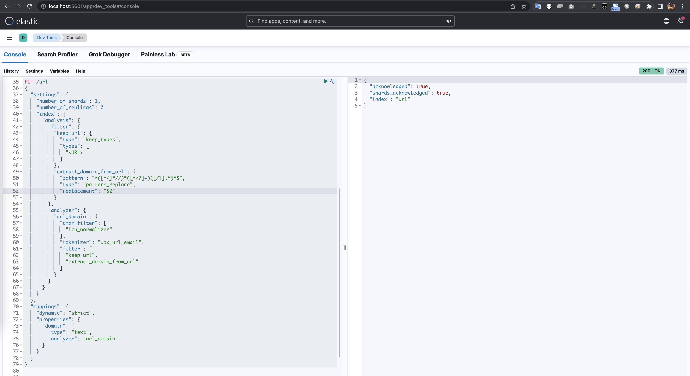

# Elasticsearch について調査したことをまとめる

主に精度高く検索できるindex設計やqueryなどについて試したことをメモしておきる。

調べた内容はテーマごとに分けてメモする。各[テーマ](elasticsearch/theme)に index.json, query用json, 説明用README がある。

## 環境構築

1. ESのDockerImageをbuildする
　
```
# start from repository root
cd elasticsearch/docker
./build.sh
```

2. ESとKibanaを起動する

```
# start from repository root
cd elasticsearch
# 初回だけ
./docker_init.sh
./docker_run.sh
```

これで、 http://localhost:9200 でESへアクセスできるし、 http://localhost:5601 でKibanaへアクセスできる。

## index作成、データ準備、検索

Kibanaをブラウザで開いて、各[テーマ](elasticsearch/theme)にある index.json をコピペして実行する

例：


データ投入や検索QueryもKibana経由で実行すれば色々検証できる。